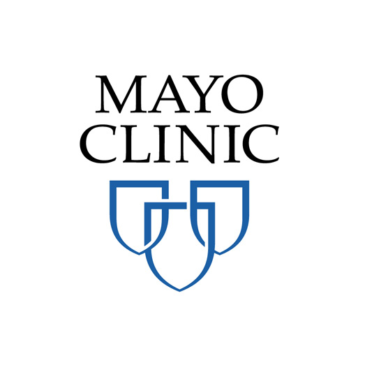

## **`DISCLAIMER:`**  

The content on the site is NOT medical advice. Although some content may be provided by medical professionals, users acknowledge that access or use of the content does not create a provider-patient relationship and does not constitute medical advice, treatment, diagnosis or services of any kind. The information is provided for educational purposes only and as such is not a substitute for professional medical attention and treatment by medical professionals. Users are solely responsible and accept all liability resulting from use of the content and any related services or products.

App developed and hosted at Mayo Clinic. No User Data will be saved on this server. 

