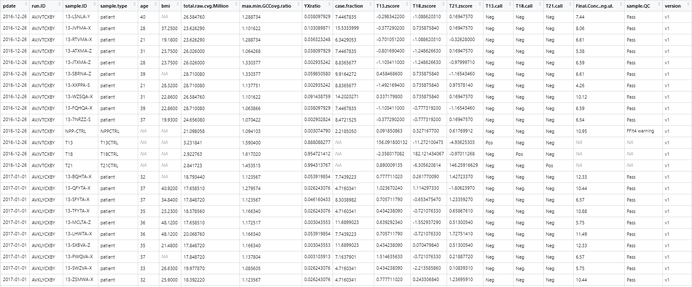
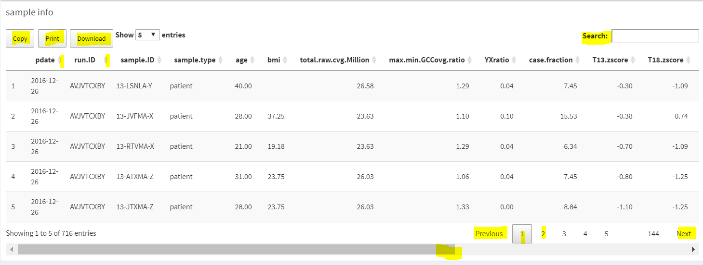
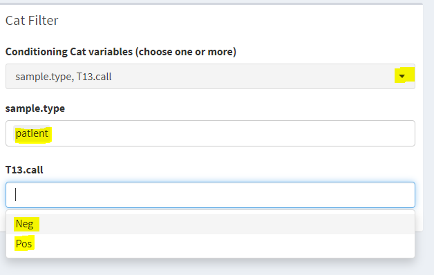
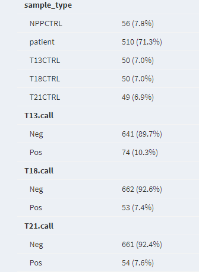
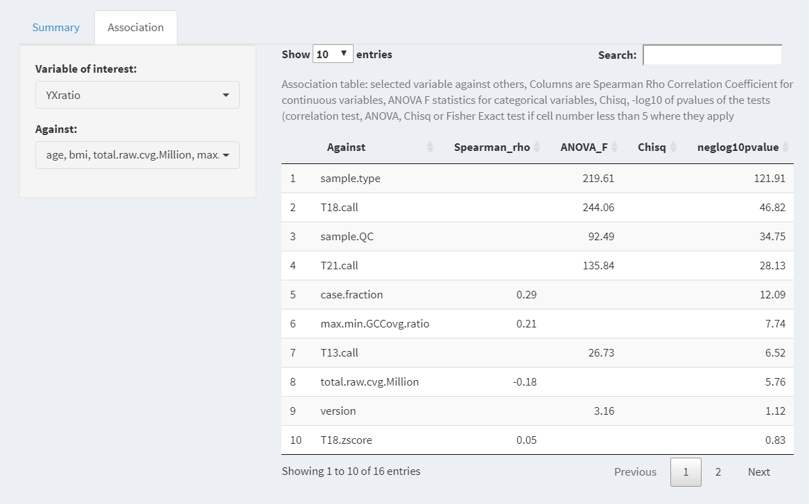
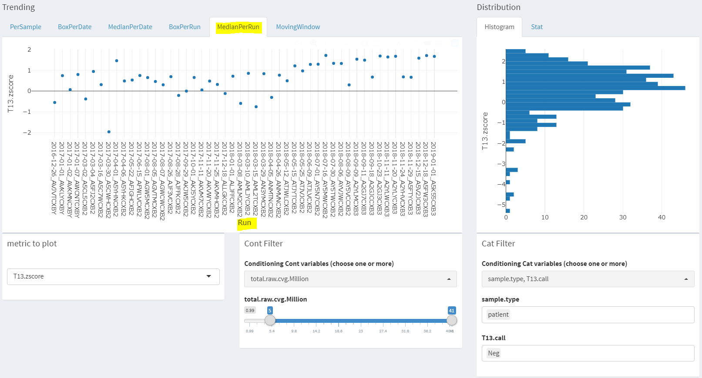
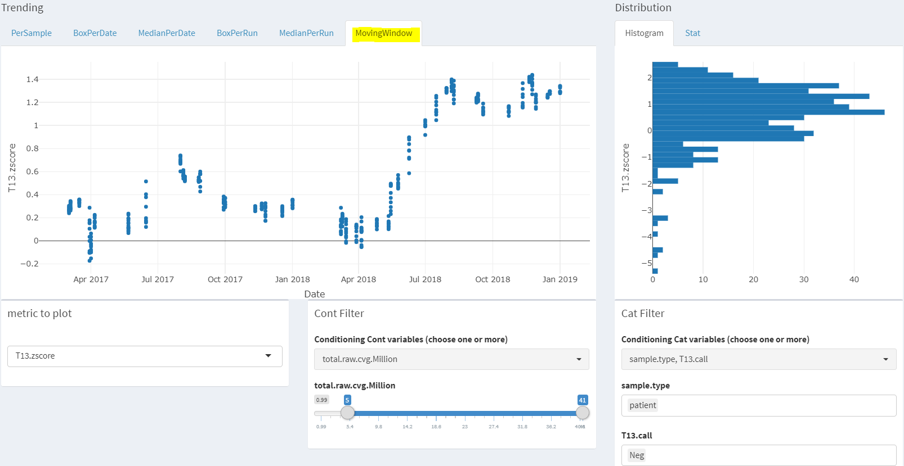
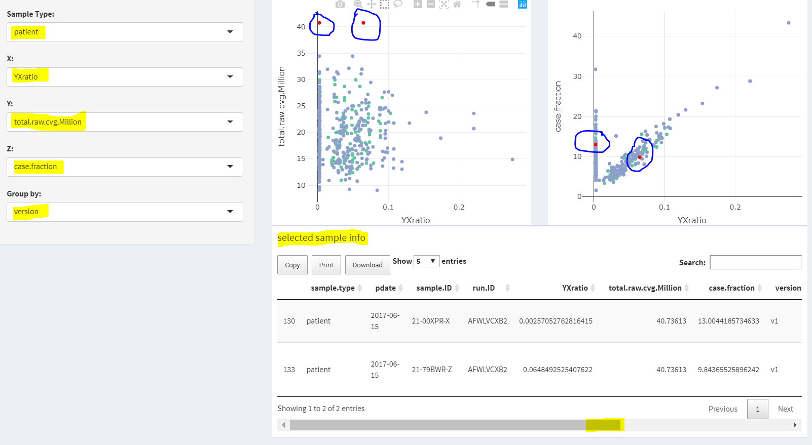

## Start to use `Longitudinal and Interactive Monitoring of Quality Characteristics (LIMQC)`

### **Overview**

This interactive application allows you to explore a longitudinal data across a period of time. Data exploration, descriptive statistics, QC dashboard, interactive graphs including trending, correlation, comparison, and multi-panel examination, are ensembled in this app.

### **Date range input**

CLICK ME TO SHOW/HIDE DETAILS

Enter date in format yyy-mm-dd or select from calendar. By default, the app will show the earliest date of the loaded data as from date, the current date as to date. 

### **Input Data**
#### **Demo data**

CLICK ME TO SHOW/HIDE DETAILS

by default, an example data from a bioinformatics pipeline was compiled and preloaded to the app. This will help you get familar with the functions of this app.   

  

Here is the screenshot of the example data in tabluate format.  
  

CLICK ME TO SHOW/HIDE DETAILS

Description of each metric element of the Demo Data is as following.   

CLICK ME TO SHOW/HIDE DETAILS

pdate: processing date in date format, eg. 2019-01-11 in demo data;   

run.ID: name of each run, eg. “HMLJYBCX2”;   

sample.ID: name of sample, eg. “19-S3962-A-03-00”;   

sample.type: Sample type, eg. “patient”, “NPPCTRL”, “T13CTRL”, “T18CTRL”, or “T21CTRL”;   

sample.QC: QC status of each sample, eg. “Pass”, “FFlt4 warning”, or “GC Bias warning”;   

age: age of the tested subject, eg. 35;   

bmi: BMI of the tested subject, eg. 27.35;   

total.raw.cvg.Million: total raw read counts in million from sequencing,eg. 23.626290;   

max.min.GCCovg.ratio: a GC bias metrics from pipeline, eg. 1.101622;   

YXratio: ChrY and ChrX ratio, an algorithm derived bioinformatics metric used to classify fetus gender, eg. 0.103089871;   

case.fraction: fetal fraction, an algorithm derived bioinformatics metric used to determine percentage of fetus dna in material plasma, eg. 15.5333999;   

T13.zscore: Chr13 Zscore, an algorithm derived bioinformatics metric used to call Trisomy 13, eg. -0.37729020;   

T18.zscore: Chr18 Zscore, an algorithm derived bioinformatics metric used to call Trisomy 18, eg. 0.735875840;   

T21.zscore: Chr21 Zscore, an algorithm derived bioinformatics metric used to call Trisomy 21, eg. 0.16947570;   

T13.call: Trisomy 13 calling, eg. “Neg” or “Pos”;   

T18.call: Trisomy 18 calling, eg. “Neg” or “Pos”;   

T21.call: Trisomy 21 calling, eg. “Neg” or “Pos”;   

Final.Conc..ng.ul.: Final DNA concentration in ng.ul unit, eg. 8.06;   

Version: DNA preparation methods, simplified as v1 and v2.    

#### **Upload your own data** 

CLICK ME TO SHOW/HIDE DETAILS

You may upload your own data by toggling on the radio button  "Upload your own data".   

Click on browse, which will open up your file directory. The app will accept csv format. Once the uploading is complete, all the data summary and visulization QC plots will be updated based on the uploaded data. If you need to switch back to the Demo data, just toggle on the radio button "Demo Data".   

   

This app requires the following format for your uploaded data.   

1. Data is in csv format, rows are samples, columns are metric elements.   

2. your data has to have the following five variables with exact the same names:   
  + __pdate__ : processing date in date format;   
  + __run.ID__: name of each run;   
  + __sample.ID__: name of sample;   
  + __sample.type__: Sample type (could be clinical patient, lab control, or other controls)   
  + __sample.QC__: QC status of each sample "Pass" or "Fail" or other warnings;   
  
  
3. Other variables including eg. grouping, other metrics. 

### **Start**

Start page is this page intended to show users how to use this app in each major tab.

### **Data Examinations**

#### **Number of runs & samples**

Two balue boxes shows the summary number of runs and samples in the selected date range and sample type with other filtering.   

CLICK ME TO SHOW/HIDE DETAILS

#### **Sample Type**

Choose Sample Type for further summary. Sample Type is summarized from **sample.type** variable in the data. In Demo Data, it has the values of the following: NPPCTRL patient T13CTRL T18CTRL T21CTRL.   

#### **Cols to display**

Select variables (columns) in the data to show in the bottom Sample info table.   

CLICK ME TO SHOW/HIDE DETAILS

Click on the arrow to the right to pull down the menu, you may select all, or deselect all, or check desired single variables one by one manually.   

#### **Sample info**

Sample information of selected columns to display are shown as data table. All the tables can be copied, printed, downloaded (in format of CSV, EXCEL, PDF), or sorted by different columns, with searching ability.    

CLICK ME TO SHOW/HIDE DETAILS

#### **Cont Filter**

Filtering on Continuous variables chosen from drop down list, then using sliding bar to change range.    

#### **Cat Filter**

Filtering on Categorical variables chosen from drop down list, then select levels of values to include. 

Note: if two or more filters are applied, they are AND operation. All other dashboard information will change accordingly  

CLICK ME TO SHOW/HIDE DETAILS

### **Data Descr**

Surmmary Tab shows stats of variables that in the data. Start with continuous variables followed by categorical variables. Basic description is given for user to have the genearl idea of the data.

CLICK ME TO SHOW/HIDE DETAILS

Association Tab shows user selected variables and its association table with other variables (default all except sample.ID, and itself). Start with continuous variables followed by categorical variables. If user selected variable is continous, the Pearson Correlation Coefficient will be shown for the against coninuous variables in descending order. ANOVA pvalues will be shown for this variable against other categorical variables in ascending order. If the user selected variable is categorical, the ANOVA pvalue of this variable agains each continuous variable will be shown in ascending order, and the Chisq-test pvalues of this variable against other categorical variable will be shown in ascendig order. Chi-squared approximation may be replaced with Fisher exact test if table cell element is less than 5 which is indeicated by the column cell_lt_5.

CLICK ME TO SHOW/HIDE DETAILS

### **QC Dashboard**

Tab shows stats of samples of selected Sample Type in selected date range with QC warnings in three ways: Dash board, Monthly summary, tabulates of QC warning types in most recent day run, most recent week runs, most recent month runs, most recent year runs and since pipeline went live or the earliest date of the samples. QC warning is a predefined variable with different types output from pipeline data. It can be defined as “Pass” if user data does not have the QC warning output from their bioinformatics pipeline. 

CLICK ME TO SHOW/HIDE DETAILS

### **Interactive Graphs**

**`Trending`** Tab shows time series plots per sample, boxplot per date, median per date, boxplot per run, median per run, moving window average (default 50) for selected samples.  Distribution of the selected metric is shown as histogram and basic summary statistics on the side.

CLICK ME TO SHOW/HIDE DETAILS

Example1. Per Sample trending scatter plot of T13.Zscore, each dot is a sample from patient sample with filtering on T13.Zscore between -0.2 and 10.   

  

Example2. Per Date trending box plot of T13.Zscore, each boxplot is summarized from patient sample with filtering on T13.Zscore between -0.2 and 10 for each process date. Note that if multiple runs are processed on one date, the summary is on all the samples processed on that date.   

  

Example3. Median Per Date trending plot of T13.Zscore, each dot is a median of the value of patient samples with filtering on T13.Zscore between -0.2 and 10 for each process date.   

  

Example4. Per Run trending box plot of T13.Zscore, each boxplot is a run summarized from patient samples with filtering on T13 calling negative, and total.raw.cvg.Million between 5 and 41.  Note that: the order is still in time order. Only summary is on run level not date level.  

  

Example5. Median Per Run trending plot of T13.Zscore, each dot is a median of a run summarized from patient samples with filtering on T13 calling negative, and total.raw.cvg.Million between 5 and 41. Note that: the order is still in time order. Only summary is on run level not date level.   

  

Example6. Moving window trending plot of Final.Conc..ng.ul, each boxplot is a run summarized from patient sample with filtering on QC pass.   

  

**`Correlation`** Tab shows scatter plot of any two user selected metrics for user selected sample type. Filtering is available on the metrics. Tooltip annotation (point labeling) can be customized.  Summary of linear regression is printed below plot, if add trend line is toggled. X and Y axis could be log transformed.  

CLICK ME TO SHOW/HIDE DETAILS

Example. Scatter plot of YX ratio vs case.fraction from patient sample with filtering on YXratio between 0.0049 and 0.28. Labeled points with pdate, sample.ID and runID so that these information will show up when mouse over each point. Added trend line from linear regression. A simple summary of hypothesis testing correlation is shown in text below the plot. The example shows YXratio is significantly associated with case.fraction for male fetus which is expected. If this relationship is not shown, there must be something not correct. A good tool for both fact checking and new relationship exploration.   

**`Comparison`** Tab shows Comparison between distributions for selected metric of selected Sample Type. The histograms by “Group by” variables are shown in one plot. Groups could be turned on or off by user to see any combination of the comparison. 

CLICK ME TO SHOW/HIDE DETAILS

Example. Overlapping histograms are to show the batch effect of the distibution of the metric Final.Conc..ng.ul by preparation version. The Demo Data is simulated to have the difference.  

**`Multi panel`** Tab shows two scatter plots of any three user selected metrics for user selected sample type. Key features include: 
  1) the two plots are interactively bilaterally linked, which means user can select a point or points with lasso or box selection on either plot, the linked sample(s) will be highlighted in red on both plots; 
  2) primary information of the selected samples is listed at the bottom of the plots in format of data table; 
  3) Grouping is available; 
  and 4) Tooltip annotation (point labeling). This is a good tool for data exploration for example outlier identification.  

CLICK ME TO SHOW/HIDE DETAILS

Example. The linked two panels are showing 1) total.raw.cvg.Million vs YXraio and 2) case.fraction vs YXratio. One purpose is to check the relationships of three variables at one time. Another purpose is to identify any outlier. Selecting points in one plot, the linked same sample(s) are highlighted in red on both plots. The selected sample info table shows the details of these selectied samples. Samples can be colored by different groups, in this example, by version.   

